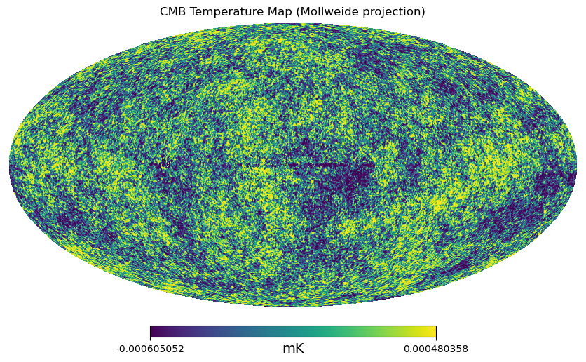

# ASTROPHYSICS
a collection of simulation on astrophysics, relativity and cosmology.

## Content
This github repository contains a few astrophysical simulations.

1) "geodesic.ipynb" solves for the equation of motion of a test particle in Schwarzschild space-time using Schwarzschild metric and geodesic equation. It also computes the Innermost Stable Circular Orbit(ISCO)

2) "Molecular_Cloud.c" simulates molecular cloud dynamics using SPH.

3) "Potential_Tree.jl" computes graviational forces for N-body problem based on a hierarchial tree approach where clustering of particles based on their position is done and then based on the target particle potential due to particles within the cluster and potential due to the center of gravity of the other clusters are taken . All potentials correspond to Newtonian Potentials.

4) "NewtonianAccretion.ipynb" solves the Flux equation in the accretion disk around a blackhole using Newtonian gravity.

5) "GR_Accretion.ipynb" applies General Relativistic correction to the FLux equation used in "NewtonianAccretion.ipynb".

6) "FLRW_scale_factor.py" computes the evolution of scale factor of the universe with time for different values of cosmological parameters.

8) "TensorCalculator-GeneralRelativity.ipynb" computes the Connection coefficients, Rieman Tensor, Ricci Tensor, Scalar Curavature, Einstein Field Tensor, Weyl Tensor and other tensors for a given metric .

9) "galaxy_correlations.ipynb" does the following: create a map with random galaxy distribution, 
Determine galaxy count at a given flux in far-infrared to build a map of Poisson distribution of galaxies, 
Spatially correlate the sources using the power spectrum of the CIB.

10) The "KleinGordon.ipynb" numerically solves the Klein-Gordon Equations in various potentials and initial conditions like 
Inflationary field, dark energy field with initial flactuations on uniform background, solitonic solutions, coupled fields
and many more.

11) "CMB.ipynb" plots the CMB power spectrum and temperature as heat maps.

12) "gravitational_lensing.ipynb" simulates and computes gravitational lensing phenomenon.

13) "GW.ipynb" downloads data from Gravitational Wave Observatories ike VIRGO and analyses the data obtaining plots of strain vs time since
the GW event , Amplitude Spectral Density , q-Transform ,background noise ,Spectrogram and cohenrence in background noise.

